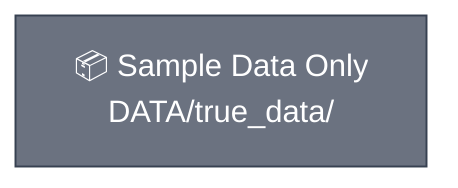

# Architecture — Built Up Stage by Stage

This diagram grows one subgraph at a time as each lesson is introduced. On this branch, nothing has been built yet.

The next stage (`stage-1-ingestion`) adds the first real subgraph: the
document ingestion pipeline.