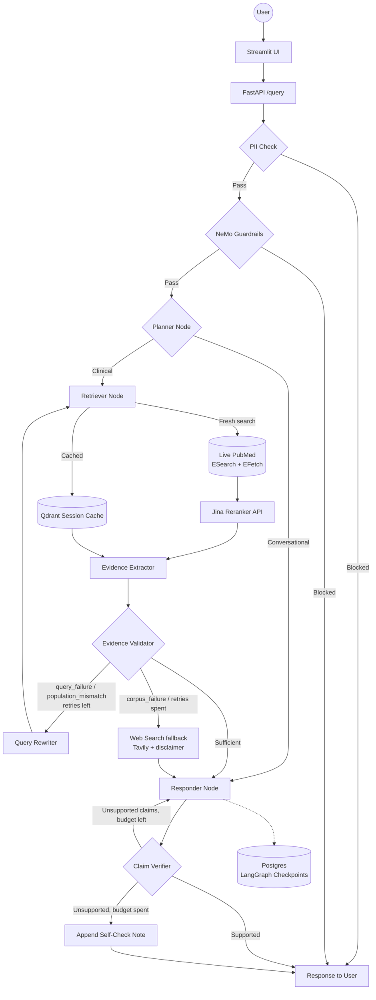

## Agentic AI workflow

```mermaid
graph TD
    User((User)) --> UI[Streamlit UI]
    UI --> API[FastAPI /query]
    API --> PII{PII Check}
    PII -->|Blocked| Response[Response to User]
    PII -->|Pass| Guard{NeMo Guardrails}
    Guard -->|Blocked| Response
    Guard -->|Pass| Planner{Planner Node}
    Planner -->|Conversational| Responder[Responder Node]
    Planner -->|Clinical| Retriever[Retriever Node]
    Retriever -->|Fresh search| PubMed[(Live PubMed\nESearch + EFetch)]
    Retriever -->|Cached| SessionCache[(Qdrant Session Cache)]
    PubMed --> Reranker[Jina Reranker API]
    Reranker --> Extractor[Evidence Extractor]
    SessionCache --> Extractor
    Extractor --> Validator{Evidence Validator}
    Validator -->|Sufficient| Responder
    Validator -->|query_failure / population_mismatch\nretries left| Rewrite[Query Rewriter]
    Rewrite --> Retriever
    Validator -->|corpus_failure / retries spent| Web[Web Search fallback\nTavily + disclaimer]
    Web --> Responder
    Responder --> Verify{Claim Verifier}
    Verify -->|Unsupported claims, budget left| Responder
    Verify -->|Unsupported, budget spent| Caveat[Append Self-Check Note]
    Verify -->|Supported| Response
    Caveat --> Response
    Responder -.-> Memory[(Postgres\nLangGraph Checkpoints)]
```