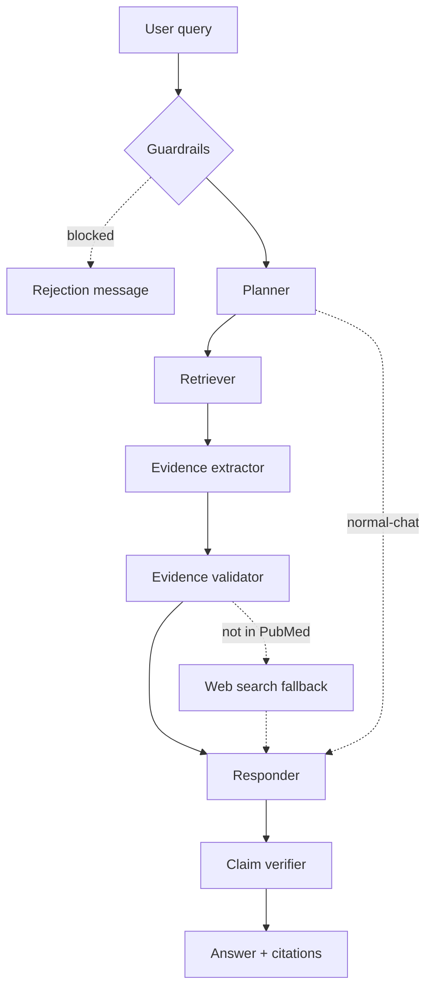

# Clinical Research Assistant

An AI-powered research assistant that helps users explore **clinical research literature** by retrieving relevant articles from **PubMed** and generating evidence-grounded answers to research questions.


## What It Can Do

- Retrieve relevant research articles from PubMed based on the user's query.
- Answer clinical research questions using information from the retrieved literature.
- Generate concise summaries of specific research papers.
- Provide responses grounded in the retrieved scientific literature.
- Keep multiple conversations going and switch between them from the sidebar, with history persisted in Postgres.


## Example Queries

**Summarize a specific paper**

> Generate a summary for this paper:
> [https://pubmed.ncbi.nlm.nih.gov/39796530/](https://pubmed.ncbi.nlm.nih.gov/39796530/)

**Ask a research question**

> How does the Tang cell count correlate with COVID-19 disease severity?

## Tech Stack

| Layer                          | Technology                                        |
| ------------------------------ | ------------------------------------------------- |
| API & UI                       | FastAPI, Streamlit                                |
| Agent Orchestration            | LangChain, LangGraph                              |
| Literature Retrieval           | Live PubMed (NCBI E-utilities — ESearch + EFetch) |
| Embeddings                     | Jina Embeddings API                               |
| Session Cache / Vector Search  | Qdrant (per-thread PubMed result cache)           |
| Reranker                       | Jina Reranker API                                 |
| LLM Gateway                    | Portkey + Groq                                    |
| Query Cache                    | Portkey                                           |
| Conversation Memory / Sessions | Postgres (LangGraph checkpoints + sessions list)  |
| Safety                         | NVIDIA NeMo Guardrails, regex-based PII filter    |
| Observability                  | LangSmith, Logfire                                |
| Evaluation                     | RAGAS, DeepEval                                   |


---


## Agentic AI workflow

Simplified overview — the main path is the straight line down; dotted arrows are the two
"skip" routes (see [CLAUDE.md](CLAUDE.md) for the full node graph):



Two bounded retry loops aren't drawn: if the validator finds the evidence off-target it sends a
rewritten query back to the retriever (CRAG), and if the claim verifier finds unsupported claims
it sends the draft back to the responder to regenerate.


**Step by step:**

- **Guardrails** — every query first hits a regex PII check and the NeMo Guardrails gate (off-topic / jailbreak / self-check); blocked queries never reach the agent.
- **Planner** — classifies the message as conversational (answer from memory) or clinical (retrieve); also detects a pasted PMID/URL for direct lookup.
- **Retriever** — one live PubMed search (or this thread's Qdrant cache), reranked by the Jina Reranker API.
- **Evidence extractor** — turns abstracts into PMID-grounded evidence records; drops any record citing a PMID outside the retrieved set.
- **Evidence validator** — a claim-level sufficiency check; the graph routes on its verdict:
  - *sufficient* → responder
  - *`query_failure` / `population_mismatch`* → `query_rewriter` rewrites the query and the retriever re-runs — a **Corrective-RAG (CRAG)** loop bounded by `CRAG_MAX_RETRIES`
  - *`corpus_failure`* (topic isn't in PubMed), or the CRAG loop has retried `CRAG_MAX_RETRIES` times without finding good evidence → Tavily web search; the answer carries an explicit "outside the curated PubMed evidence base" disclaimer + source links
- **Responder** — generates a citation-backed answer; citations are derived deterministically from the evidence, not from the LLM's prose.
- **Claim verifier** — fact-checks the answer against its evidence. Unsupported claims send the draft back to the responder once for a rewrite; if any remain, the answer keeps them but adds a visible ⚠️ caveat.

```
...normal answer text about the drug's efficacy...

⚠️ Self-Check Note
The following statement(s) may not be fully supported by the retrieved evidence:
- Metformin reduces cardiovascular mortality by 30% in non-diabetic patients
```

In a clinical-research context a silently dropped claim would hide the exact statement a user shouldn't act on; a visible caveat lets them judge it themselves.

## Setup


### Prerequisites

- Python 3.11+ with [uv](https://docs.astral.sh/uv/)
- Docker + Docker Compose (for Postgres)


### Configuration

```bash
cp .env.example .env
```

Fill in `.env` with your own credentials — see the comments in `.env.example` for what each variable is for. `NCBI_CONTACT_EMAIL` is required; Qdrant, Groq, Portkey, and Jina keys come from those services' own dashboards (Qdrant can be a free Cloud cluster — there's no local/self-hosted option in this setup).

### Install

```bash
# Preferred: uv resolves and installs from pyproject.toml / uv.lock
uv sync

# Fallback: pip with the exported lockfile (requirements.txt is auto-generated
# via `uv export --format requirements.txt --no-hashes -o requirements.txt`)
python -m venv .venv && source .venv/bin/activate
pip install -r requirements.txt
```

## Running the App

```bash
# 1. Start Postgres
docker compose up -d postgres

# 2. Start the FastAPI backend
uv run uvicorn app.main:app --reload

# 3. In a separate terminal, start the Streamlit chat UI
uv run streamlit run streamlit_app.py
```

**Backend** — `http://127.0.0.1:8000`


| Method | Path     | Description                                              |
| ------ | -------- | -------------------------------------------------------- |
| `GET`  | `/`      | Health check                                             |
| `GET`  | `/graph` | LangGraph agent diagram                                  |
| `POST` | `/query` | Submit a query — body `{"q": "...", "thread_id": "..."}` |


**Frontend** — `http://127.0.0.1:8501`

Chat UI that calls the backend at `BACKEND_URL`, with per-conversation memory via `thread_id` and expandable sources/thought-process panels per answer.

## Running Tests

Unit and integration tests live under `tests/` and run via `pytest`.

```bash
uv run pytest
```


## Running Evals

Correctness of retrieval and generation is checked via the eval suite in `evals/`, which drives the live `/query` endpoint against `evals/golden_dataset.json` and scores with RAGAS/DeepEval. The backend must be running (`uv run uvicorn app.main:app --reload`) before starting the eval UI.

```bash
uv run streamlit run evals/app.py
```

Guardrails behavior (the input gate, independent of retrieval/generation quality) is scored separately via `evals/guardrails_eval.py`.