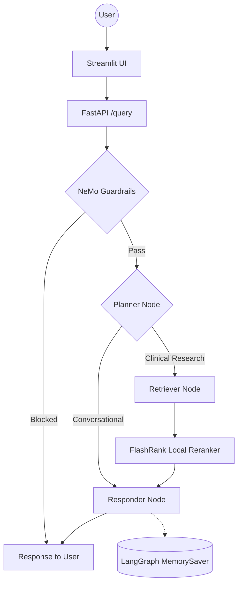

# healthcare-research-assistant

Multi agent healthcare research assistant using LangGraph.

## Tech Stack

| Layer | Technology |
|---|---|
| API & UI | FastAPI, Streamlit |
| Agent Orchestration | LangChain, LangGraph |
| Embeddings | BiomedBERT (local, biomedical-domain) |
| Vector Search | Qdrant, FlashRank reranking |
| LLM Gateway | Portkey + Groq |
| Safety | NVIDIA NeMo Guardrails |
| Observability | LangSmith, Logfire |
| Evaluation | RAGAS, DeepEval |
| Document Ingestion | PDF / HTML / Office parsing pipeline |

---

## Agent Intelligence Flow



## Setup

Requires Python 3.11+ and [uv](https://docs.astral.sh/uv/).

```bash
uv sync
cp .env.example .env
```

Fill in `.env` with your own credentials — see the comments in `.env.example` for what each variable is for.

## Running Ingestion

Parses documents from `DATA/`, chunks them (`app/ingestion/chunking/splitter.py`), embeds locally with `NeuML/biomedbert-small-embeddings`, and indexes them into the Qdrant collection.

```bash
# Ingest everything under DATA/, wiping and recreating the collection first
uv run python -m app.ingestion.processor DATA --wipe

# Ingest a single source folder without wiping (source type inferred from folder name)
uv run python -m app.ingestion.processor DATA/true_data true
```

Parsed chunks + metadata are also saved locally to `processed_data/<source_type>/<filename>.json` for inspection.

## Running the Retrieval Pipeline (API + UI)

Ingestion must have completed at least once (a populated Qdrant collection) before querying.

```bash
# 1. Start the FastAPI backend
uv run uvicorn app.main:app --reload

# 2. In a separate terminal, start the Streamlit chat UI
uv run streamlit run streamlit_app.py
```

- Backend: `http://127.0.0.1:8000` — `GET /` health check, `GET /graph` for the LangGraph agent diagram, `POST /query` with `{"q": "...", "thread_id": "..."}`
- Frontend: `http://127.0.0.1:8501` — chat UI that calls the backend at `BACKEND_URL`, with per-conversation memory via `thread_id` and expandable sources/thought-process panels per answer

Each query flows through NeMo Guardrails first (blocks off-topic/jailbreak input before it reaches the agent), then the LangGraph agent (`app/agents/graph.py`): a planner decides whether the message is conversational or needs retrieval, an optional retriever queries Qdrant and reranks with FlashRank, and a responder generates the grounded answer via the Portkey-routed Groq model.