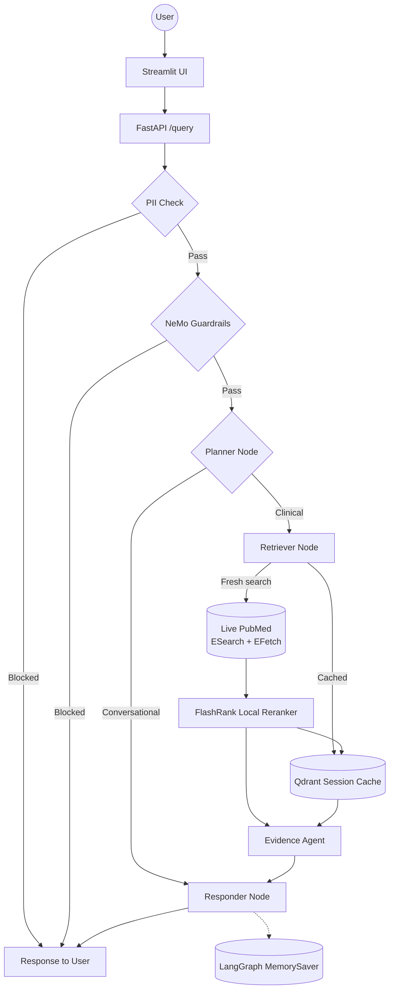

# Clinical Research Assistant

- Engineered AI Assistant that can answer user query related to Clinical Research, it retrive relvent articls from PubMed and answer to user. 
- User can ask queries like:
  - *Generate summary for this [https://pubmed.ncbi.nlm.nih.gov/39796530/](https://pubmed.ncbi.nlm.nih.gov/39796530/) paper*
  - *How does the Tang cell count correlate with COVID-19 disease severity?*


## Tech Stack

| Layer | Technology |
|---|---|
| API & UI | FastAPI, Streamlit |
| Agent Orchestration | LangChain, LangGraph |
| Literature Retrieval | Live PubMed (NCBI E-utilities — ESearch + EFetch) |
| Embeddings | BiomedBERT (local, biomedical-domain) |
| Session Cache / Vector Search | Qdrant (per-thread PubMed result cache), FlashRank reranking |
| LLM Gateway | Portkey + Groq |
| Safety | NVIDIA NeMo Guardrails, regex-based PII filter |
| Observability | LangSmith, Logfire |
| Evaluation | RAGAS, DeepEval |

---

## Agentic AI workflow



Each query first passes a regex-based PII check and the NeMo Guardrails gate (off-topic/jailbreak/self-check) before reaching the LangGraph agent. The `planner` classifies the message as conversational or clinical; for clinical queries the `retriever` runs a live PubMed search (or reuses this thread's cached results), reranks with FlashRank, and the `evidence_agent` extracts PMID-grounded evidence before the `responder` generates the final, citation-backed answer.

## Setup

### Prerequisites

- Python 3.11+
- [uv](https://docs.astral.sh/uv/) (preferred) — or `pip` with `requirements.txt` as a fallback

### Installation

```bash
# Preferred: uv resolves and installs from pyproject.toml / uv.lock
uv sync

# Fallback: pip with the exported lockfile (requirements.txt is auto-generated
# via `uv export --format requirements.txt --no-hashes -o requirements.txt`)
python -m venv .venv && source .venv/bin/activate
pip install -r requirements.txt
```

### Configuration

```bash
cp .env.example .env
```

Fill in `.env` with your own credentials — see the comments in `.env.example` for what each variable is for. `NCBI_CONTACT_EMAIL` is required by NCBI's usage policy; `NCBI_API_KEY` is optional but raises the E-utilities rate limit from 3 req/s to 10 req/s.

## Running the App

There is no ingestion step — retrieval is live against PubMed at query time.

```bash
# 1. Start the FastAPI backend
uv run uvicorn app.main:app --reload

# 2. In a separate terminal, start the Streamlit chat UI
uv run streamlit run streamlit_app.py
```

**Backend** — `http://127.0.0.1:8000`

| Method | Path | Description |
|---|---|---|
| `GET` | `/` | Health check |
| `GET` | `/graph` | LangGraph agent diagram |
| `POST` | `/query` | Submit a query — body `{"q": "...", "thread_id": "..."}` |

**Frontend** — `http://127.0.0.1:8501`

Chat UI that calls the backend at `BACKEND_URL`, with per-conversation memory via `thread_id` and expandable sources/thought-process panels per answer.

## Running Tests

Unit and integration tests live under `tests/` and run via `pytest`.

```bash
uv run pytest
```

## Running Evals

There is no automated test suite for answer *quality* — correctness of retrieval and generation is checked via the eval suite in `evals/`, which drives the live `/query` endpoint against `evals/golden_dataset.json` and scores with RAGAS/DeepEval. The backend must be running (`uv run uvicorn app.main:app --reload`) before starting the eval UI, and `NCBI_API_KEY` should be set to stay within NCBI's rate limit since each clinical sample makes a real PubMed call.

```bash
uv run streamlit run evals/app.py
```

Guardrails behavior (the input gate, independent of retrieval/generation quality) is scored separately via `evals/guardrails_eval.py`.
